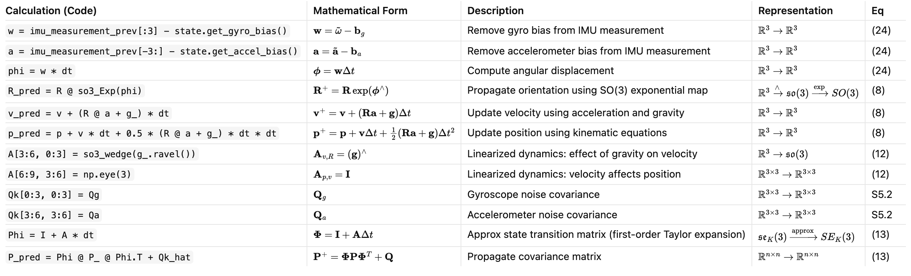

Single file implementation of the Landmark example of https://github.com/RossHartley/invariant-ekf in Python.

# Definitions

With equation or section reference in if applicable: https://arxiv.org/pdf/1904.09251

# State Definitions

# Propagate Step

# Correction Step
